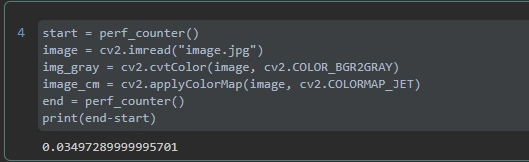

# LW1

## Задание
  1. Реализовать программу согласно варианту задания. Базовый алгоритм, 
используемый в программе, необходимо реализовать в 3 вариантах: с 
использованием встроенных функций какой-либо библиотеки (OpenCV, 
PIL и др.) и нативно на Python + |с использованием Numba или C++|.
  2. Сравнить быстродействие реализованных вариантов.
  3. Сделать отчёт в виде readme на GitHub, там же должен быть выложен 
исходный код

## Вариант 7

   Колоризация. На вход поступает изображение, программа отрисовывает 
окно, в которое выводится либо исходное изображение после 
преобразования в черно-белое, либо после колоризация с помощью 
заранее определенной шкалы (переключение по нажатию клавиши). 
Базовый алгоритм - колоризация

## Замер производительности.

В рамках задания были реализованы 3 версии программы:
- с использованием opencv;
- алгоритм колоризации пишется нативно на питоне;
- алгоритм колоризации пишется нативно на питоне + используется JIT;

#Результат работы программы + вывод на экран:

#Результаты работы на OPENCV:

#Алгоритм колоризации написанный нативно на питоне:

#Алгоритм колоризации пишется нативно на питоне + используется JIT

В плане быстродействия результат предсказуем. Минимальное количество времени требуется при использовании OpenCV, 
больше требует реализация на нативном питоне + JIT, и совсем печальный результат на нативном питоне без JIT

## Теоретическая база
Колоризация — преобразование монохромного (чёрно-белого) кинематографического или фотоизображения в цветное. 
Колоризация считается разновидностью цветного кинематографа или фотографии и применялась до изобретения этих технологий.

RGB или КЗС — аддитивная цветовая модель, описывающая способ кодирования цвета для цветовоспроизведения с
помощью трёх цветов, которые принято называть основными. Выбор основных цветов обусловлен особенностями физиологии 
восприятия цвета сетчаткой человеческого глаза.

## Описание разработанной системы
Для преобразования в монохромное изображение использовалась формула вида:

Для получения цветного изображения использовалась обратная процедура с использованием цветовой шкалы JET * 255,
поскольку изначальный формат был float.

## Источники мои источники
- https://habr.com/ru/post/539228/
- https://docs.opencv.org/4.x/
- https://www.allaboutcircuits.com/technical-articles/understanding-color-models-used-in-digital-image-processing/