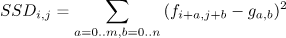
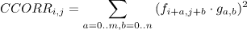
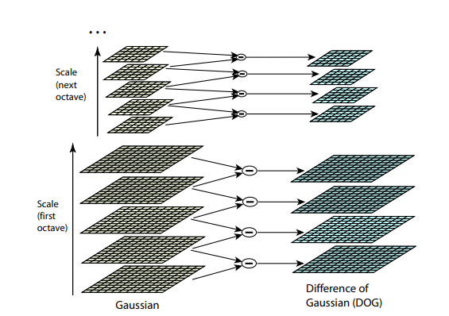
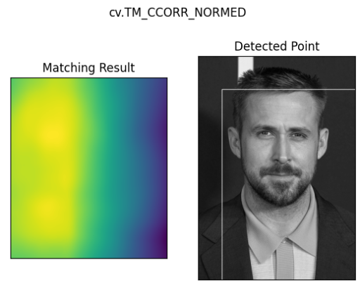
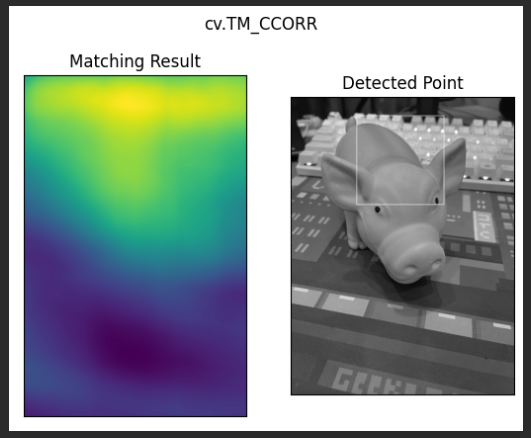
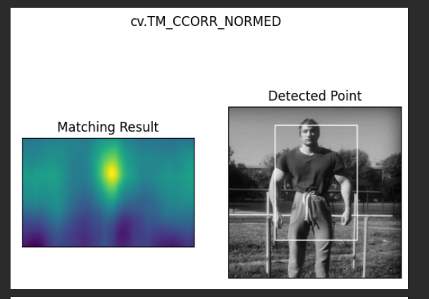
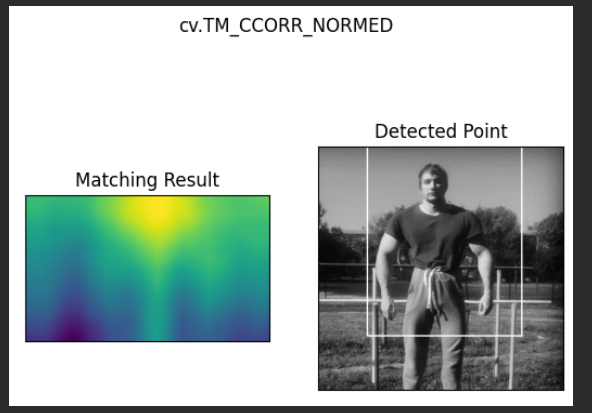
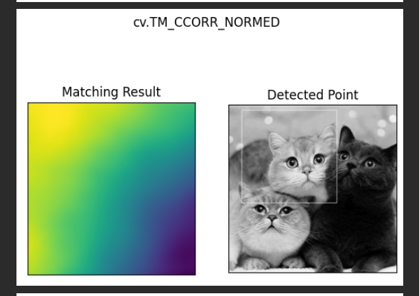
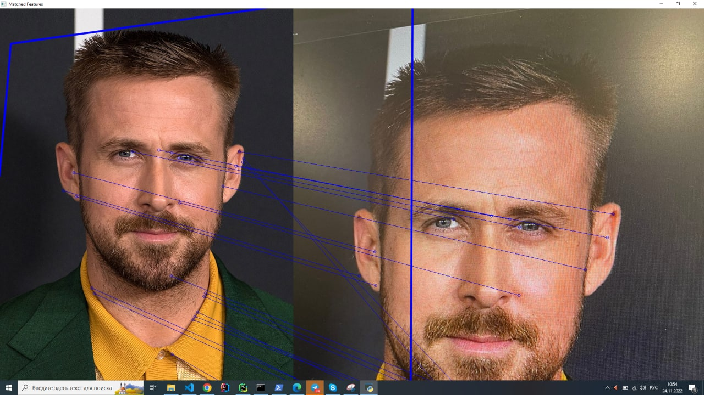

# LW2

## Задание
- 1. Реализовать программу согласно описанию. Можно использовать языки 
C++ или Python и любые библиотеки, при этом необходимо чтобы вся
задача не решалась только с помощью одной встроенной функции 
(например, lib.detect_template(image, template).
- 2. Сравнить качество работы двух вариантов реализации по точности 
детектирования.
- 3. Сделать отчёт в виде readme на GitHub, там же должен быть выложен 
исходный код.

## Теоретическая база
Template matching — метод, основанный на нахождении места на изображении, наиболее похожем на шаблон. 
“Похожесть” изображения задается определенной метрикой.
То есть, шаблон "накладывается" на изображение, и считается расхождение между изображением и шаблоном.
Положение шаблона, при котором это расхождение будет минимальным, и будет означать место искомого объекта.

В качестве метрики можно использовать разные варианты, например — сумма квадратов разниц между шаблоном и картинкой 
(sum of squared differences, SSD), или использовать кросс-корреляцию (cross-correlation, CCORR). 
Пусть f и g — изображение и шаблон размерами (k, l) и (m, n) соответственно (каналы цвета пока будем игнорировать);
i,j — позиция на изображении, к которой мы "приложили" шаблон.

 - CV_TM_SQDIFF — сумма квадратов разниц значений пикселей
 - CV_TM_SQDIFF_NORMED — сумма квадрат разниц цветов, отнормированная в диапазон 0..1.
 - CV_TM_CCORR — сумма поэлементных произведений шаблона и сегмента картинки
 - CV_TM_CCORR_NORMED — сумма поэлементных произведений, отнормированное в диапазон -1..1.
 - CV_TM_CCOEFF — кросс-коррелация изображений без среднего
 - CV_TM_CCOEFF_NORMED — кросс-корреляция между изображениями без среднего, отнормированная в -1..1 (корреляция Пирсона)

1) смещения
2) поворот
3) масштаб (один и тот же объект может быть разных размеров на различных изображениях)
4) изменения яркости
5) изменения положения камеры

## Результат работы
exp1 - изначальное изображение -- скаченное фото Райана Гослинга. Изображение для сравнения -- фото экрана с открытым 
изображением. Результат положительный.

exp2 - изначльное изображение хрюшка, второе изображение - чутка повернутая хрюшка

exp3 - изначльное изображение + отзеркаленое и обрезаное

exp4 - изначальное изображение + отзеркаленое сверху вниз + обрезка

exp5 - изначальное изображение 

## Описание разработанной системы
Для преобразования в монохромное изображение использовалась формула вида:

Для получения цветного изображения использовалась обратная процедура с использованием цветовой шкалы JET * 255,
поскольку изначальный формат был float.

## Источники мои источники
- https://habr.com/ru/post/539228/
- https://docs.opencv.org/4.x/
- https://www.allaboutcircuits.com/technical-articles/understanding-color-models-used-in-digital-image-processing/